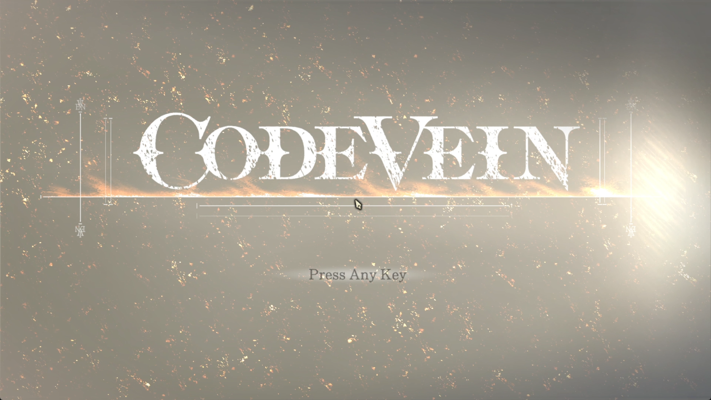
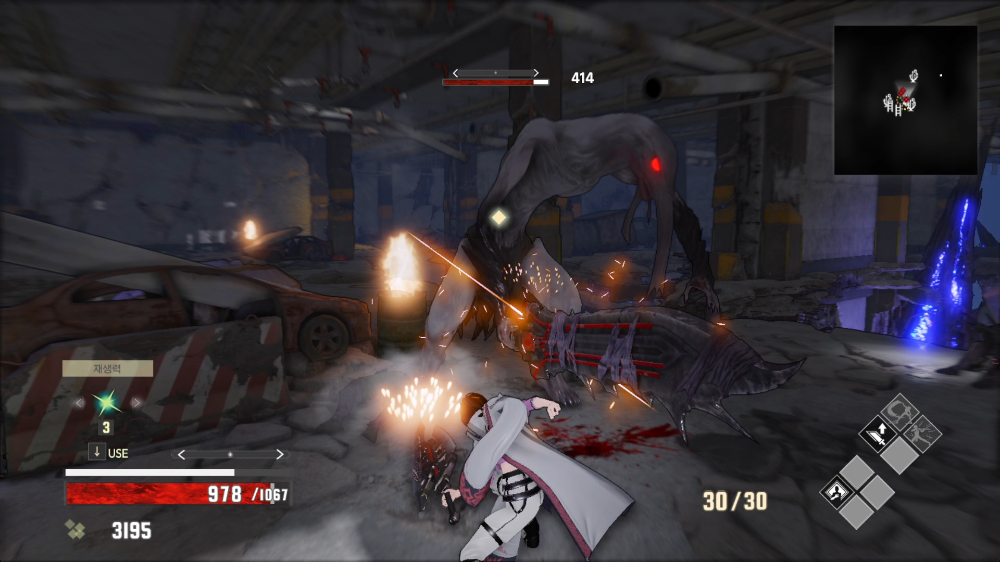
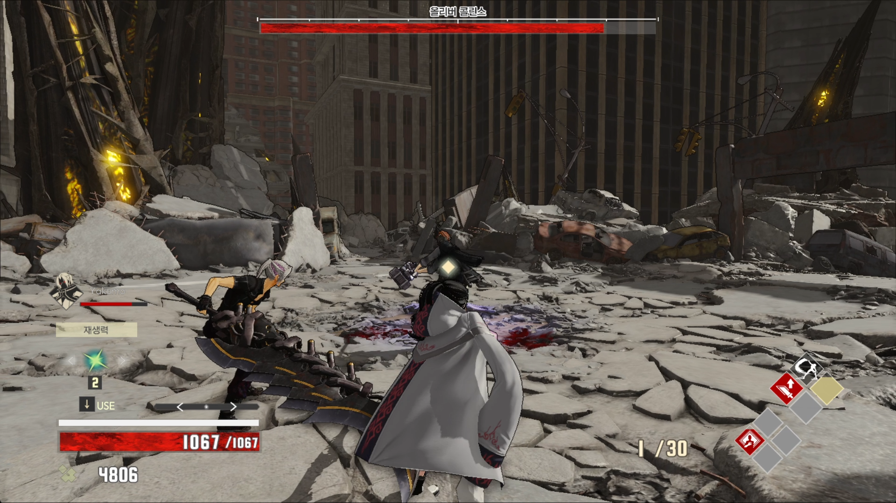
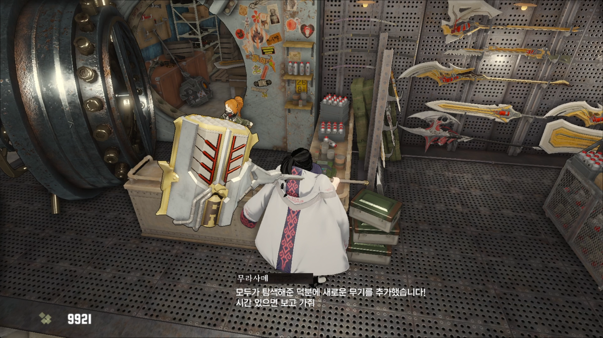
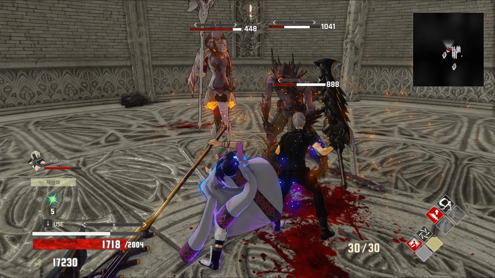
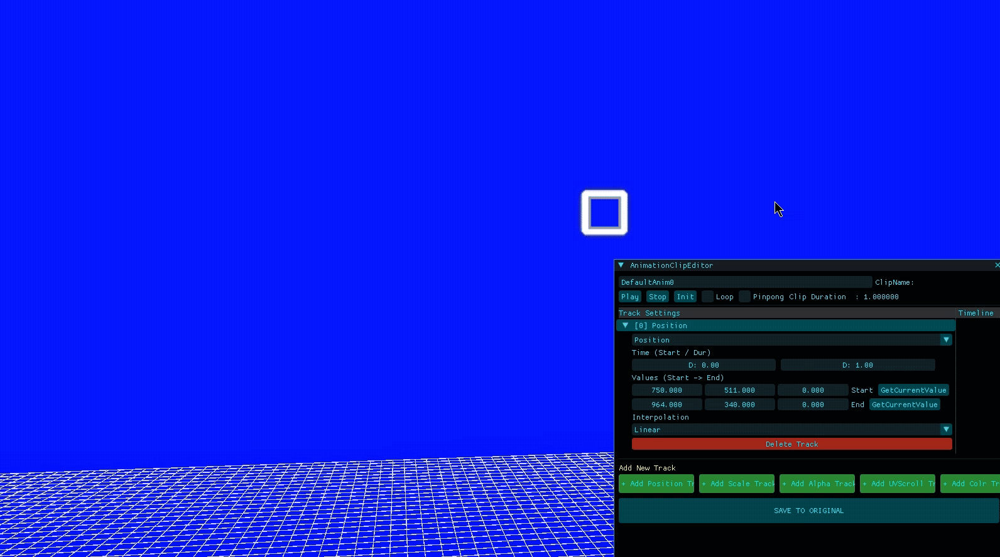

# CODE VEIN 모작

  

## 🎮 프로젝트 소개

DirectX11 기반으로 제작한 액션 RPG 「CODE VEIN」 모작 팀 프로젝트입니다.  
6인 팀 프로젝트로 진행되었으며 UI, Monster AI, Gameplay System 파트를 담당했습니다.

Component 기반 UI Framework와 전용 UI Tool을 구현하여 데이터 기반으로 UI를 제작할 수 있는 환경을 구성했으며,  
이를 기반으로 커스터마이징, Inventory, Dialogue, HUD 등의 Gameplay UI를 구현했습니다.

---

## 📅 개발 기간

2026.01.22 ~ 2026.04.02  
약 3개월

---

## 👨‍💻 개발 인원

6명

---

## 🛠 개발 환경

### Language
- C++

### Graphics API
- DirectX 11
- HLSL

### 주요 기술
- Component 기반 UI
- Data-Driven UI
- EventBus
- RenderTarget
- Shader
- JSON Serialization

---

## 📌 담당 구현 기능

| 구분 | 구현 내용 |
|---|---|
| UI / Gameplay | 커스터마이징, Inventory 및 장착, 선택지 기반 Dialogue, Player HUD |
| Framework | Component 기반 UI Framework, UI 생명주기 및 입력 · 렌더링 관리 |
| Tool | UI 배치 · Component 구성 · 계층 구조를 JSON으로 저장하는 UI Tool |
| Monster | SlaveDevil, GiantVampire, DevilMonkey, Slime AI 및 전투 패턴 |
| Rendering / UI | RenderTarget 및 Shader 기반 Player 중심 회전형 Minimap |

---

## 🎥 시연 영상

- [기술 설명 영상](https://youtu.be/ylQe65Ghskw)
- [인게임 영상](https://youtu.be/nUbA5ZfwmmU)

---

## 📷 프로젝트 이미지

| 타이틀 | 인게임 스크린샷1 |
|:---:|:---:|
|  |  |

| 인게임 스크린샷2 | 인게임 스크린샷3 |
|:---:|:---:|
|  |  |

| 인게임 스크린샷4 | 인게임 스크린샷5 |
|:---:|:---:|
|  |  |

---

# ⭐ 주요 구현 사항

# 🧩 Gameplay / Contents

## 1. UI 공통화 및 Player 외형 연동 기반 커스터마이징 시스템

  

### 개요

색상, Texture, Mesh, 수치형 데이터를 선택할 수 있는 커스터마이징 UI를 구현하고 선택 결과가 실제 Player 외형에 반영되도록 구성했습니다.

### 주요 내용

Color Palette와 Texture / Mesh / Value Selector를 공통 Picker 구조로 구성하고, 커스터마이징 종류에 따라 필요한 UI를 활성화하도록 구현했습니다. 선택한 데이터는 공통 커스터마이징 데이터로 관리하여 머리, 피부, 눈, 의상, Face Paint 등 Player의 다양한 외형 요소에 반영하도록 구성했습니다.

---

## 2. ItemData 기반 Inventory 및 장착 시스템

  

### 개요

Item 데이터를 기반으로 보유 Item, 장비, 소비 Item, Skill과 Passive 정보를 UI에 연결하는 Inventory 시스템을 구현했습니다.

### 주요 내용

Item 선택에 따라 상세 정보를 표시하고, Item 종류에 따라 사용·장착·해제 흐름을 처리하도록 구성했습니다. 장착 결과와 Quick Slot 상태를 Gameplay 데이터와 연결하여 Inventory의 변경 사항이 실제 Player 상태와 HUD에 함께 반영되도록 구현했습니다.

---

## 3. 선택지 기반 Dialogue System

  

### 개요

NPC Dialogue 출력과 선택지 UI를 분리하고, Player의 선택에 따라 서로 다른 대화 흐름을 진행할 수 있는 Dialogue System을 구현했습니다.

### 주요 내용

기존의 순차적인 Dialogue 출력 구조를 확장하여 대화 단계에 여러 Choice를 등록하고, Player가 선택한 항목에 따라 다음 Dialogue Step과 UI 반응을 결정하도록 구성했습니다. 이를 통해 상점과 NPC Interaction 등 선택이 필요한 콘텐츠에서도 동일한 Dialogue 구조를 사용할 수 있도록 구현했습니다.

---

## 4. Player 상태 데이터 연동 기반 HUD 시스템

  

### 개요

Player의 HP, Stamina, Focus Gauge, Item Shortcut 및 Skill Quick Slot을 실시간으로 표시하는 전투 HUD를 구현했습니다.

### 주요 내용

HUD가 Player의 현재 상태 데이터를 참조하여 HP와 Stamina 등의 수치 변화를 화면에 반영하고, Inventory에서 설정한 Item 및 Skill Quick Slot 정보가 전투 HUD에도 동일하게 표시되도록 구성했습니다.

---

# ⚙️ Framework

## 1. Component 기반 UI Framework

### 개요

여러 종류의 UI를 동일한 구조에서 제작하고 관리하기 위해 Object와 Component를 조합하는 Component 기반 UI Framework를 구현했습니다.

### 주요 내용

UI의 등록과 갱신, Z-Order 기반 Picking, Window Stack과 Scene / Persistent UI의 생명주기를 공통 Manager에서 관리하도록 구성했습니다. 또한 부모-자식 계층과 Component 조합을 이용하여 Screen UI와 World UI를 동일한 구조에서 제작할 수 있도록 구현했습니다.

---

# 🛠 Tool

## 1. UI Tool

  

### 개요

UI를 코드에서 직접 배치하지 않고 전용 Tool에서 제작한 뒤 JSON 데이터로 저장하여 Runtime에서 동일하게 복원할 수 있는 UI 제작 Pipeline을 구현했습니다.

### 주요 내용

UI Object의 Transform과 Component, 부모-자식 계층 및 Prefab 정보를 Tool에서 편집하고 JSON 데이터로 저장하도록 구성했습니다. Runtime에서는 저장된 데이터를 읽어 동일한 UI 구조를 복원하여 UI의 배치 정보와 Client 로직을 분리했습니다.

---

# 🎮 추가 구현 기능

## Monster AI

  

공통 Monster State Machine을 기반으로 SlaveDevil, GiantVampire, DevilMonkey, Slime 총 4종의 AI와 전투 패턴을 구현했습니다. 각 Monster의 Animation과 상태 전환은 공통 구조를 활용하고, Slime의 천장 대기·낙하와 같은 특수 행동은 개별 State를 추가하여 확장했습니다.

---

## Player 중심 회전형 Minimap

  

RenderTarget과 World Position → Minimap UV 변환을 이용하여 Player 주변의 지형과 Object Icon을 표시하고, Camera Yaw를 기준으로 Shader에서 UV Sampling 좌표를 회전시키는 중심형 Minimap을 구현했습니다.

---

# 🔧 트러블슈팅 - Minimap 회전 시 Clipping 문제

### 🔥 문제 상황

Player의 시점에 따라 Minimap을 회전시키기 위해 RenderTarget을 출력하는 UI Quad 자체를 회전했지만, 회전된 Quad가 기존 UI 출력 영역을 벗어나면서 모서리가 잘려 보이는 문제가 발생했습니다.

### ❓ 원인 분석

Minimap Texture의 방향만 변경하면 되는 상황에서 출력 Geometry 자체를 회전하여, 정사각형 Quad의 회전 각도에 따라 일부 Pixel이 기존 UI 영역 밖으로 이동하는 것이 원인이었습니다.

### 👍 해결 방법

UI Quad는 고정한 상태로 유지하고 Pixel Shader에서 RenderTarget을 Sampling하는 **UV 좌표만 Camera Yaw 기준으로 회전하도록 변경했습니다.** Player의 World Position을 Minimap UV로 변환하고 Object Icon에도 동일한 회전 기준을 적용하여 지형과 Icon이 함께 회전하도록 구성했습니다.

### ⭐ 결과

Geometry의 출력 영역은 그대로 유지하면서 내부 Texture의 Sampling 방향만 변경하여 Minimap 회전 시 발생하던 모서리 Clipping 문제를 해결했습니다. 이를 통해 Player를 중심으로 주변 환경과 Object Icon이 자연스럽게 회전하는 중심형 Minimap을 구현했습니다.

---

# 💡 프로젝트 회고

이전 프로젝트보다 규모가 큰 팀 프로젝트에서 UI뿐만 아니라 Monster AI와 Gameplay System까지 담당하며 다양한 시스템을 구현할 수 있었습니다. 특히 UI Tool과 Component 기반 UI Framework를 제작하면서 **개별 UI를 만드는 것에서 나아가 UI를 제작하고 관리하는 구조 자체를 설계하는 경험**을 할 수 있었습니다.

UI Tool에서 제작한 데이터가 Runtime에서도 동일하게 복원되어야 했기 때문에 Tool과 Client가 공유하는 데이터 구조를 설계하고 관리하는 과정이 어려웠습니다. 또한 커스터마이징에서는 UI 선택 정보와 실제 Character Model을 연결하고, Minimap에서는 RenderTarget 회전 방식의 한계를 해결하기 위해 Shader와 UV 좌표 변환을 직접 다뤄야 했습니다.

이 과정에서 **UI를 데이터 기반으로 구성하고 Object와 Component의 책임을 분리하는 방법**에 대한 이해를 높일 수 있었습니다. 또한 DirectX11 환경에서 RenderTarget, Shader Resource와 UV 좌표 변환을 직접 구현하면서 UI Rendering 구조에 대한 이해를 넓힐 수 있었습니다.

---

# 🔗 링크

- Notion : [프로젝트 및 기술 문서](https://www.notion.so/UI-Gameplay-System-Monster-AI-1e62e3fb387b82ad915b015bf8af6765?source=copy_link)

